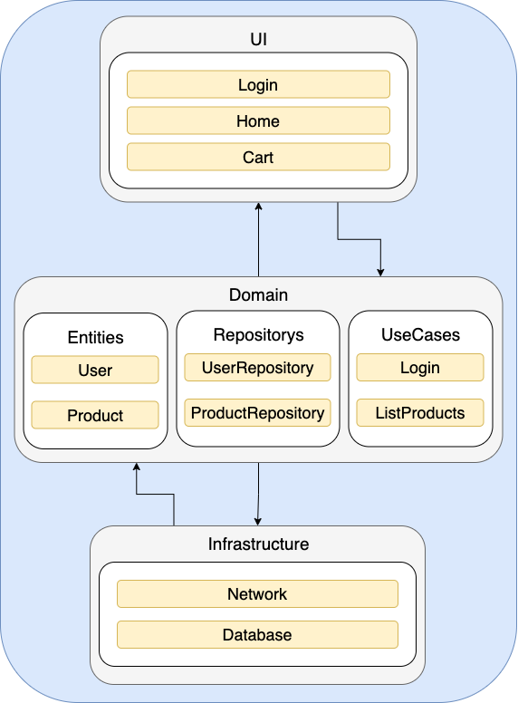
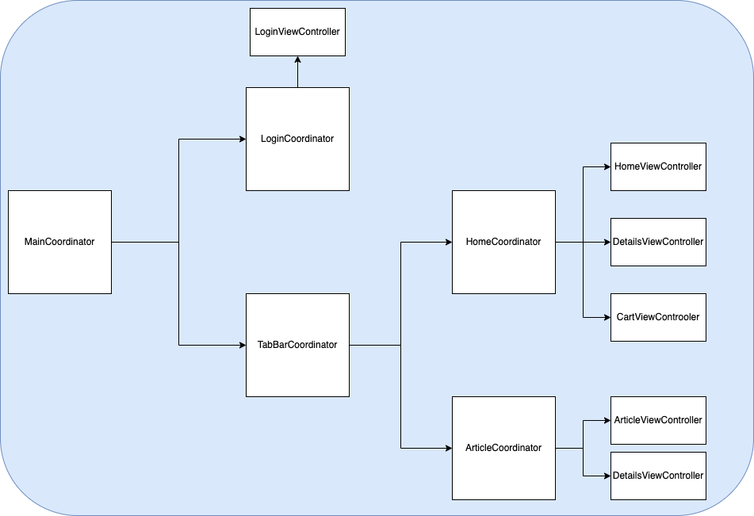
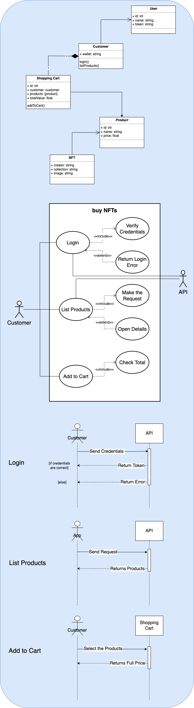

# Technology
**Xcode:** 13.4.1  
**Navigation:** Coordinator pattern  
**Minimum SDK:** iOS 15+  
**Reactivity:** Combine  
**Network:** URLSession  
**Api Mock:** Mockoon  
**Interface Stack:** UIKit  
**Unit Test:** XCTest  
**Json Parse:** Codable  

# Architecture

  
  

# Diagrams

  

